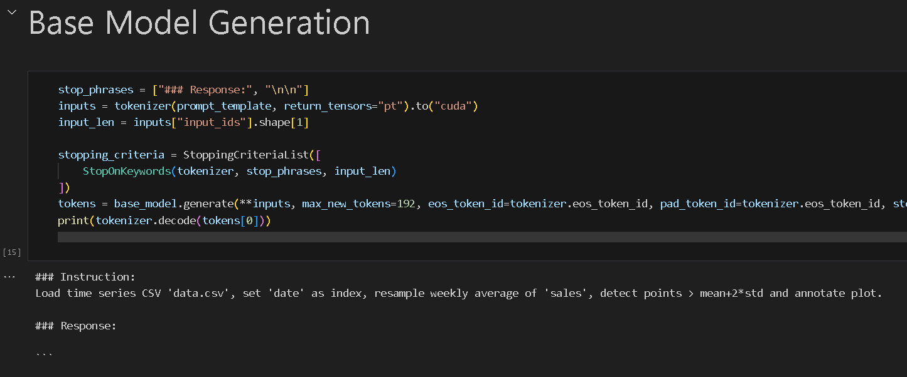
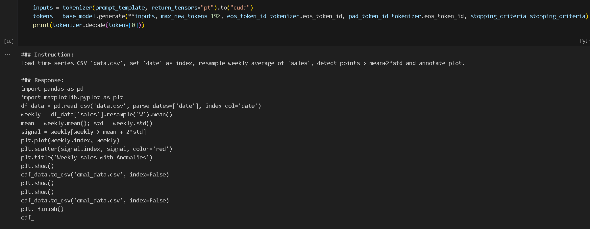
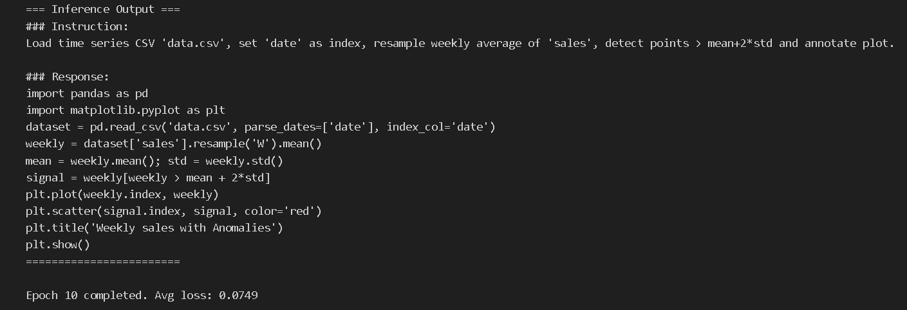

# LLM Finetuning

This project contains notebooks for fine-tuning the Pythia Large Language Model using various techniques, including PEFT (Parameter-Efficient Fine-Tuning) and custom training loops.

## Pythia-410M Model Details

Pythia-410M was trained on The Pile, an 825GiB general-purpose English-language dataset created by EleutherAI for large language model research. It is not an instruction-following model, and therefore it is challenging to achieve code generation from this base model.

## Fine-tuning Process

The Pythia-410M model was fine-tuned on custom data science-related Python code snippets. This dataset consists of 1000 high-quality code snippets generated with the help of ChatGPT.

We fine-tuned the 4-bit quantized Pythia-410M model using LoRA (Low-Rank Adaptation) configuration, specifically tuning the `q`, `k`, and `v` layers.

Our initial Version 1 model had a longer `max_len`, which significantly reduced training speed and accuracy due to the sparsity of most matrices. In the final Version 3, which is similar to Version 2, we used an optimal `max_len` based on the 95th percentile of the data's maximum length and added 4000 additional data points to the training dataset. We also incorporated generation with stopping criteria to effectively fine-tune the model within a single epoch.

## Data

The `data` folder contains the custom-generated code snippets used for fine-tuning, along with three other datasets that have slightly different code styles. These datasets are:

*   `datascience_1000_errors.jsonl`
*   `datascience_1000_multistep.jsonl`
*   `datascience_2000.jsonl`
*   `datascience_4000_multistep.jsonl`

## Notebooks

*   `fine_tune_pythia_custom_loop.ipynb`: Fine-tunes the Pythia model with a custom training loop.
*   `PEFT_FINE_TUNE_PHYTHIA.ipynb`: Fine-tunes the Pythia model using the PEFT library.
*   `PhythiaEvaluation-NO-stopping-criteria.ipynb`: Evaluates the fine-tuned Pythia model without a stopping criteria.
*   `PhythiaEvaluation-stopping-criteria.ipynb`: Evaluates the fine-tuned Pythia model with a stopping criteria.

## Evaluation Results

### ROUGE Metrics (Without Stopping Criteria)

| Model                       | ROUGE-1 | ROUGE-2 | ROUGE-L | ROUGE-Lsum |
|-----------------------------|---------|---------|---------|------------|
| Base Model                  | 0.0407  | 0.0103  | 0.0366  | 0.0390     |
| Fine-tuned (`pythia-lora-final`) | 0.6084  | 0.5067  | 0.5852  | 0.6073     |
| Fine-tuned (`pythia-lora-V2`)    | 0.8763  | 0.8164  | 0.8627  | 0.8734     |

### ROUGE Metrics (With Stopping Criteria)

| Model                       | ROUGE-1 | ROUGE-2 | ROUGE-L | ROUGE-Lsum |
|-----------------------------|---------|---------|---------|------------|
| Base Model                  | 0.0384  | 0.0097  | 0.0345  | 0.0363     |
| Fine-tuned (`pythia-lora-final`) | 0.7734  | 0.6597  | 0.7448  | 0.7697     |
| Fine-tuned (`pythia-lora-V2`)    | 0.8757  | 0.8170  | 0.8608  | 0.8749     |

### Summary of Performance

The fine-tuning process significantly improved the model's performance in generating relevant and accurate code snippets, as evidenced by the substantial increase in ROUGE scores across all metrics.

*   **Base Model:** As expected, the base Pythia-410M model, not being instruction-tuned for code generation, showed very low ROUGE scores.
*   **Fine-tuned (`pythia-lora-final`):** This version demonstrated a dramatic improvement over the base model, indicating the effectiveness of fine-tuning on custom data.
*   **Fine-tuned (`pythia-lora-V2`):** This model further improved upon the `pythia-lora-final` version, achieving the highest ROUGE scores in both evaluation scenarios. This suggests that the optimizations and configurations used for `pythia-lora-V2` were highly effective in enhancing code generation quality.

## Code Generation Examples

Here are some examples of code generation from the different models:

### Base Model Generation



### V1 Model Generation



### Final Model Generation



## Trained LoRA Adapters

All trained LoRA adapters can be downloaded from this Google Drive link: [https://drive.google.com/drive/folders/13cjgJPnlwNGt2sTMHtBDVwaQgYdbvK?usp=sharing](https://drive.google.com/drive/folders/13cjgJPnlwNGt2sTMHtBDVwaQgYdbvK?usp=sharing)

## How to Load and Use the Fine-tuned Models

To load and use the fine-tuned Pythia-410M model with the LoRA adapters, you can use the following Python code snippet:

```python
from transformers import AutoModelForCausalLM, AutoTokenizer
from peft import PeftModel, PeftConfig

# Load the base model and tokenizer
model_name_or_path = "EleutherAI/pythia-410m"
model = AutoModelForCausalLM.from_pretrained(model_name_or_path)
tokenizer = AutoTokenizer.from_pretrained(model_name_or_path)

# Load the PEFT adapter
peft_model_id = "path/to/your/downloaded/lora/adapter" # e.g., "./pythia-lora-V3"
model = PeftModel.from_pretrained(model, peft_model_id)

# Merge LoRA weights with the base model (optional, but good for inference)
model = model.merge_and_unload()

# Example of generating text
input_text = "def factorial(n):\n    if n == 0:\n        return 1\n    else:\n        return n * factorial(n-1)\n\n# Test the function\nprint(factorial(5))\n\n# Expected output: 120\n\n# Another example: calculate the sum of numbers from 1 to 10\ndef sum_numbers(n):\n    total = 0\n    for i in range(1, n + 1):\n        total += i\n    return total\n\nprint(sum_numbers(10))\n\n# Expected output: 55\n\n# Write a Python function to reverse a string\ndef reverse_string(s):\n    "

input_ids = tokenizer(input_text, return_tensors="pt").input_ids

output = model.generate(input_ids, max_new_tokens=100, num_return_sequences=1)
print(tokenizer.decode(output[0], skip_special_tokens=True))
```
